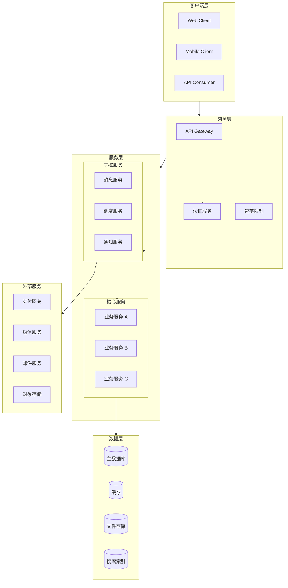
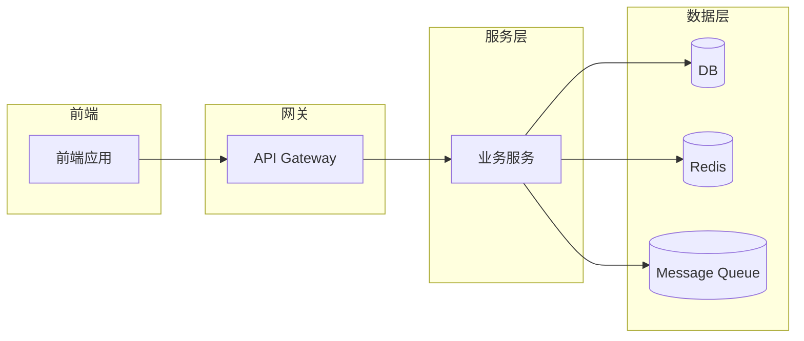
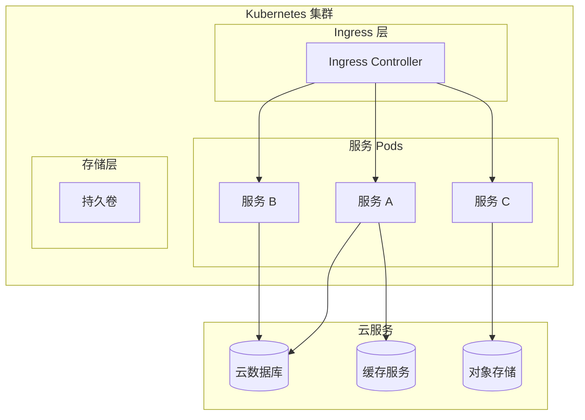
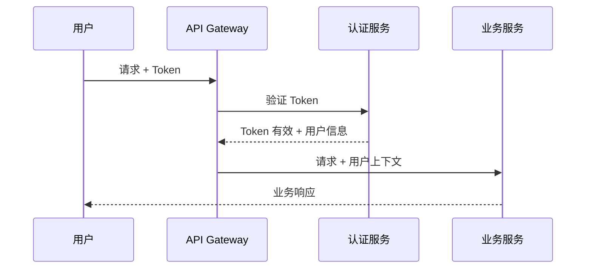

# 技术架构文档

> 本文档描述系统的技术架构设计。括号中的内容为填写提示，保留提示便于理解，替换为具体内容后删除括号。

## 1. 系统架构图

使用 Mermaid 格式绘制系统架构，便于版本控制和协作。



> **提示**: 使用 `graph TB` (Top-Bottom) 或 `graph LR` (Left-Right) 定义布局方向。
> 子图使用 `subgraph name["显示名称"]` 语法。
> 箭头 `-->` 表示依赖关系，可添加标签说明数据传输方向。

---

## 2. 模块划分

### 2.1 模块列表

| 模块名称 | 英文名 | 职责概述 | 团队负责 |
|---------|--------|---------|---------|
| [模块A] | module-a | [核心业务模块] | @team-a |
| [模块B] | module-b | [数据处理模块] | @team-b |
| [模块C] | module-c | [公共服务模块] | @team-c |

### 2.2 核心模块职责

#### 模块 A: [模块名称]

```
module-a
├── src/
│   ├── domain/          # 领域模型
│   ├── application/     # 应用服务
│   ├── infrastructure/  # 基础设施实现
│   └── interface/       # 接口层(API/CLI)
```

- **职责边界**
  - ✅ 负责: [明确职责范围]
  - ❌ 不负责: [明确职责外的内容]

- **核心实体**
  - `EntityA`: [描述]
  - `EntityB`: [描述]

- **对外接口**
  - RPC: [服务名]/[方法名]
  - 事件: [topic-name]

- **依赖模块**
  - `module-b`: [依赖原因]
  - `module-c`: [依赖原因]

---

## 3. 模块依赖关系



### 依赖说明

| 源模块 | 目标模块 | 依赖类型 | 说明 |
|-------|---------|---------|------|
| [模块A] | [模块B] | 同步/RPC | [调用关系说明] |
| [模块A] | [模块C] | 异步/消息 | [事件交互说明] |

> **提示**: 依赖类型分为:
> - **同步/RPC**: 实时调用，响应式交互
> - **异步/消息**: 基于消息队列的解耦交互
> - **共享库**: 代码级别依赖

---

## 4. 技术选型说明

### 4.1 核心技术栈

| 类别 | 技术选型 | 备选方案 | 选型理由 |
|-----|---------|---------|---------|
| 前端框架 | [如 React/Vue] | [备选] | [性能/生态/团队熟悉度等] |
| 后端运行时 | [如 Node.js/Go] | [备选] | [并发能力/开发效率等] |
| API 风格 | [REST/GraphQL] | [备选] | [灵活性/类型安全等] |
| 数据库 | [如 PostgreSQL] | [MySQL/MongoDB] | [事务支持/扩展性等] |
| 缓存 | [如 Redis] | [Memcached] | [数据结构支持/持久化] |
| 消息队列 | [如 Kafka/RabbitMQ] | [备选] | [吞吐量/可靠性等] |

### 4.2 选型原则

1. **团队熟悉度**: 优先选择团队已有经验的技术栈，降低学习成本
2. **业务适配度**: 技术选型需匹配业务场景需求
3. **生态成熟度**: 优先选择生态完善、社区活跃的技术
4. **可替换性**: 避免单点依赖，保持架构灵活性

---

## 5. 项目目录结构

```
project-root/
├── docs/                    # 项目文档
│   ├── architecture/        # 架构文档
│   └── api/                 # API 文档
│
├── src/                     # 源代码
│   │
│   ├── module-a/            # 模块 A (如为微服务则拆分为独立仓库)
│   │   ├── src/
│   │   │   ├── domain/      # 领域模型、实体、值对象
│   │   │   ├── application/ # 应用服务、用例
│   │   │   ├── infrastructure/ # 基础设施实现
│   │   │   └── interface/   # 接口层 (API/Controller/CLI)
│   │   ├── tests/           # 测试代码
│   │   ├── package.json     # 或 pyproject.toml / pom.xml
│   │   └── README.md
│   │
│   ├── module-b/
│   │   └── ...
│   │
│   └── shared/              # 共享库/公共代码
│       ├── utils/
│       ├── types/
│       └── constants/
│
├── scripts/                 # 脚本文件
│   ├── dev.sh              # 开发环境启动
│   └── deploy.sh           # 部署脚本
│
├── config/                  # 配置文件
│   ├── local/              # 本地开发配置
│   ├── staging/            # 预发环境配置
│   └── production/         # 生产环境配置
│
├── docker/                  # Docker 相关
│   ├── Dockerfile
│   └── docker-compose.yml
│
├── .env.example             # 环境变量模板
├── .gitignore
├── README.md
└── LICENSE
```

> **提示**: 目录结构应体现领域驱动设计思想，核心模块按业务边界划分，基础设施代码与业务代码分离。

---

## 6. 部署架构



### 部署配置

| 环境 | 副本数 | 资源配额 | 域名 |
|-----|-------|---------|------|
| 开发环境 | 1 | 0.5C/512MB | dev.example.com |
| 预发环境 | 2 | 1C/1GB | staging.example.com |
| 生产环境 | 3+ | 2C/2GB | api.example.com |

---

## 7. 安全设计

### 7.1 认证授权



### 7.2 安全措施

| 层级 | 措施 | 说明 |
|-----|------|------|
| 传输层 | HTTPS/TLS | 加密传输 |
| 网关层 | 认证、限流、WAF | 入口防护 |
| 服务层 | 鉴权、参数校验 | 业务防护 |
| 数据层 | 加密存储、备份 | 数据安全 |

---

## 8. 扩展性设计

### 8.1 水平扩展

- **无状态服务**: 服务层设计为无状态，支持快速扩缩容
- **会话管理**: 使用 Redis 集中管理会话，支持多实例共享
- **负载均衡**: 网关层实现负载均衡，自动流量分发

### 8.2 读写分离

```
                    ┌─────────────┐
                    │   应用层    │
                    └──────┬──────┘
                           │
              ┌────────────┼────────────┐
              ▼                         ▼
      ┌─────────────┐           ┌─────────────┐
      │  主库 (写)   │           │  从库 (读)   │
      └─────────────┘           └─────────────┘
```

### 8.3 分库分表策略

[描述分库分表的策略和依据]

---

## 9. 监控与运维

### 9.1 监控体系

| 指标类型 | 采集工具 | 告警阈值 |
|---------|---------|---------|
| 基础设施 | Node Exporter | CPU > 80% |
| 应用性能 | APM | 响应时间 > 500ms |
| 业务指标 | 自定义 | 错误率 > 1% |

### 9.2 日志规范

```
级别: DEBUG < INFO < WARN < ERROR
格式: JSON
字段: timestamp, level, trace_id, module, message, metadata
保留: 开发 7天, 预发 30天, 生产 90天
```

---

## 10. 变更记录

| 版本 | 日期 | 作者 | 变更内容 |
|-----|------|-----|---------|
| 0.1 | [日期] | [姓名] | 初始版本 |
