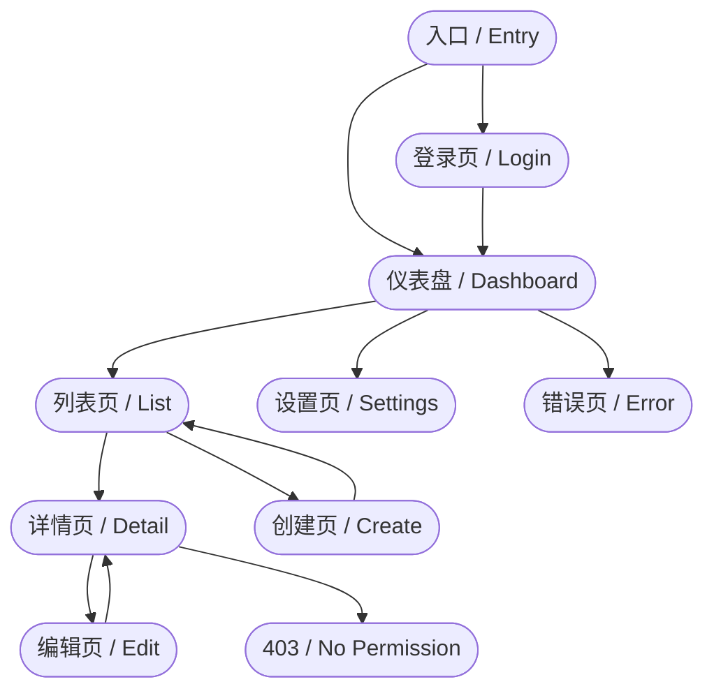
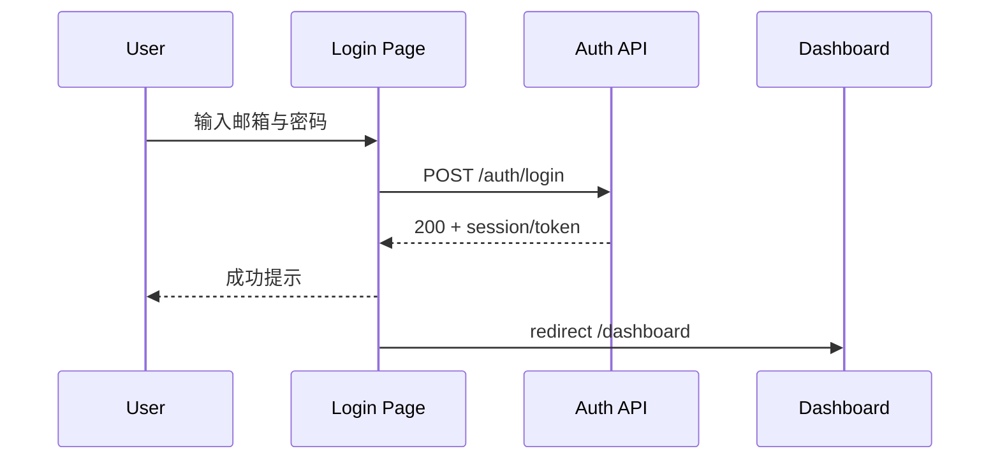
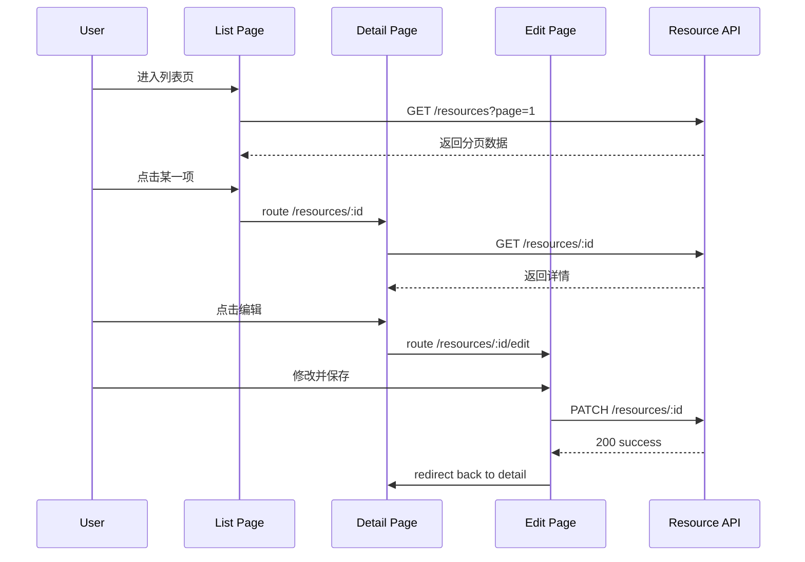

# 页面流程（Page Flow）
<!-- depends-on: 01-需求文档 -->
<!-- required-for: web -->
<!-- generation-order: 3 -->

<!-- AGENT: 仅 Web 全栈项目使用本模板。目标不是“画一个图”，而是把页面、路由、守卫、前置条件、异常回退、跨页面参数传递全部写清楚，让 Agent 能据此继续生成 06-页面功能细节 和 03-接口文档。 -->

## 1. 文档目标（Document Goal）

<!-- AGENT: 用 3-5 句话说明本项目页面体系的总体结构。必须回答：主要用户是谁、核心页面链路是什么、哪些页面是入口、哪些页面需要登录、哪些页面承载核心业务。 -->

- **页面体系概述 Page System Overview**: <!-- AGENT: 例如“本系统由仪表盘、资源列表、资源详情、资源创建/编辑、设置页构成。大多数业务页面需要登录后访问。” -->
- **核心入口 Core Entry Points**: <!-- AGENT: 例如“默认入口为 /dashboard；首次登录后跳转到 onboarding；未登录统一进入 /login。” -->
- **关键业务链路 Critical Business Flows**: <!-- AGENT: 例如“登录 → 仪表盘 → 商品列表 → 商品详情 → 编辑保存 → 返回列表。” -->

---

## 2. 页面清单（Page Inventory）

<!-- AGENT: 从 01-需求文档 中所有 P0/P1 用户故事推导页面。每个用户故事至少映射 1 个页面；如果一个故事跨多个页面，全部列出。不要使用“页面1/页面2”之类占位写法。 -->

| 页面名称 Page | 路由 Route | 优先级 Priority | 访问级别 Access | 来源故事 Story | 说明 Description |
|---|---|---|---|---|---|
| 登录页 Login | `/login` | P0 | public | US-001 | 用户输入凭证并建立会话 |
| 仪表盘 Dashboard | `/dashboard` | P0 | auth | US-002 | 展示关键指标、快捷入口、待处理事项 |
| 列表页 List Page | `/resources` | P0 | auth | US-003 | 展示资源集合，支持搜索、筛选、分页 |
| 详情页 Detail Page | `/resources/:id` | P0 | auth | US-003 | 查看单个资源的完整信息 |
| 创建页 Create Page | `/resources/new` | P0 | auth | US-004 | 新建资源 |
| 编辑页 Edit Page | `/resources/:id/edit` | P1 | auth | US-004 | 修改资源并提交保存 |
| 设置页 Settings | `/settings` | P1 | auth | US-005 | 管理偏好、角色、系统选项 |

### 2.1 生成规则（Generation Rules）

<!-- AGENT: 生成时严格遵守以下规则。 -->

1. 所有 `public` 页面必须说明何时跳转到登录后页面。
2. 所有 `auth` 页面必须说明未登录时的重定向目标。
3. 所有带 `:id` 的详情/编辑页，必须在后续章节写清参数来源。
4. 如果某用户故事不需要独立页面，可映射为弹窗/抽屉，但要显式说明。
5. 不允许写“若干页面”“其他页面”这种模糊表述。

### 2.2 页面分层（Page Categories）

| 分类 Category | 说明 | 典型页面 |
|---|---|---|
| 入口页 Entry | 用户首次进入系统时可到达的页面 | Login, Landing, Dashboard |
| 工作页 Work Surface | 用户持续操作和完成任务的页面 | List, Detail, Edit |
| 系统页 System | 配置、账户、权限、帮助等页面 | Settings, Profile, Audit |
| 异常页 Exceptional | 错误、无权限、空状态、维护页 | 403, 404, Empty, Maintenance |

---

## 3. 顶层导航图（Top-Level Navigation Graph）

<!-- AGENT: 用 Mermaid flowchart 画页面级跳转，不要在此处画 API 调用细节。必须至少覆盖：入口、核心列表、详情、编辑、设置、错误页。 -->



### 3.1 图生成要求（Graph Rules）

<!-- AGENT: 生成真实项目图时必须满足： -->

- 节点名使用真实页面名，不要写 A/B/C。
- 入口页与受保护页面分开。
- 至少包含 1 条失败路径和 1 条回退路径。
- 如存在多角色入口，增加 role-based 分支。

---

## 4. 核心用户流程（Core User Flows）

<!-- AGENT: 至少生成 3 个流程。每个流程必须包含目标、入口、步骤、异常、完成状态。优先覆盖 P0 用户故事。 -->

### Flow 1 — 登录进入工作台（Login to Workspace）

**目标 Goal**: 用户成功建立会话并进入系统主页面。



**步骤 Steps**:
1. 用户访问 `/login`。
2. 输入凭证并提交。
3. 系统验证通过后建立会话。
4. 跳转到 `/dashboard`。

**异常处理 Exceptions**:
- 凭证错误 → 保留表单输入，显示“邮箱或密码错误”。
- 账号被禁用 → 禁止登录并展示联系管理员说明。
- 网络失败 → 显示重试按钮，不清空表单。

**完成状态 Done State**:
- 用户位于 `/dashboard`
- 全局状态中已有用户信息和权限集

### Flow 2 — 列表到详情再到编辑（List → Detail → Edit）

**目标 Goal**: 用户从资源列表进入详情并完成一次编辑保存。



**步骤 Steps**:
1. 列表页加载分页数据。
2. 用户点选一条记录进入详情页。
3. 详情页加载单条数据。
4. 用户点击编辑进入编辑页。
5. 提交成功后返回详情页。

**异常处理 Exceptions**:
- 详情数据不存在 → 跳转 404 页面。
- 用户无编辑权限 → 停留详情页并显示只读提示。
- 提交校验失败 → 停留编辑页并高亮错误字段。

### Flow 3 — 设置页修改偏好（Settings Update）

**目标 Goal**: 用户在设置页修改偏好并看到立即生效。

**步骤 Steps**:
1. 用户从导航进入 `/settings`。
2. 系统加载当前偏好与权限边界。
3. 用户修改主题、通知或筛选偏好。
4. 提交后展示保存成功反馈。
5. 返回其他页面时，新偏好立即生效。

**异常处理 Exceptions**:
- 未授权字段被提交 → 返回 403 并恢复旧值。
- 保存超时 → 提供重试，不丢失本地修改。

---

## 5. 路由契约（Routing Contract）

<!-- AGENT: 这里定义页面与守卫、布局、元信息之间的契约；后续 06-页面功能细节 和 03-接口文档 都会依赖这里。 -->

```ts
type RouteConfig = {
  path: string;
  page: string;
  guards: string[];
  layout: "public" | "app" | "settings";
  meta: {
    title: string;
    requiresAuth: boolean;
    resource?: string;
  };
};
```

| 路由 Route | 页面组件 Page | 布局 Layout | 守卫 Guards | 标题 Title |
|---|---|---|---|---|
| `/login` | `LoginPage` | public | `guest-only` | 登录 |
| `/dashboard` | `DashboardPage` | app | `auth` | 仪表盘 |
| `/resources` | `ResourceListPage` | app | `auth` | 资源列表 |
| `/resources/:id` | `ResourceDetailPage` | app | `auth` | 资源详情 |
| `/resources/:id/edit` | `ResourceEditPage` | app | `auth`, `can-edit:resource` | 编辑资源 |
| `/settings` | `SettingsPage` | settings | `auth` | 设置 |

### 5.1 参数与状态传递（Route Params & State Passing）

| 从 From | 到 To | 参数 Params | 方式 Method | 说明 |
|---|---|---|---|---|
| List | Detail | `id` | URL param | 资源主键 |
| Detail | Edit | `id`, `from=detail` | URL query | 返回来源 |
| Login | Dashboard | `redirect` | query / state | 登录后回跳 |
| Settings | Any | `toast=saved` | URL query / store | 保存成功提示 |

### 5.2 守卫规则（Guard Rules）

- `guest-only`: 已登录用户不可再访问登录页。
- `auth`: 未登录跳转 `/login?redirect=current-url`。
- `can-edit:resource`: 需要编辑权限；否则进入详情只读态或 403。

---

## 6. 页面状态与跨页依赖（Page State & Cross-Page Dependencies）

| 状态名 State | 范围 Scope | 来源 Source | 被哪些页面使用 |
|---|---|---|---|
| `currentUser` | global | auth session | Dashboard, Settings, Detail |
| `permissions` | global | auth/session bootstrap | All protected pages |
| `listFilters` | page/shared | URL + local storage | List |
| `selectedResourceId` | route | route param | Detail, Edit |
| `toastQueue` | app | client store | All pages |

### 6.1 状态生成规则（State Rules）

<!-- AGENT: 若某状态跨 2 个以上页面共享，则定义为 global/shared；若只服务于单页交互，则定义为 page state。 -->

1. 过滤器状态优先放 URL，保证可分享链接。
2. 会话和权限状态放全局 store。
3. 编辑表单草稿放页面本地状态，除非需要跨页恢复。

---

## 7. 异常与回退流程（Error and Recovery Flows）

| 场景 Scenario | 触发条件 Trigger | 页面行为 | 用户反馈 | 后续动作 |
|---|---|---|---|---|
| 未登录访问受保护页面 | 直接访问 `/dashboard` | 重定向到 `/login` | 显示“请先登录” | 登录后回跳 |
| 资源不存在 | 访问错误 `id` | 进入 404/空状态 | 显示“资源不存在” | 返回列表 |
| 权限不足 | 访问编辑页但无权限 | 进入只读态或 403 | 显示无权限提示 | 联系管理员 / 返回详情 |
| 保存失败 | PATCH 返回 422/500 | 停留当前页 | 表单错误提示/Toast | 重试 |
| 网络断开 | 请求失败 | 使用本地缓存/保留当前视图 | 显示离线状态 | 恢复后重试 |

### 7.1 必写异常（Mandatory Exceptions）

<!-- AGENT: 对每个核心流程，至少覆盖以下异常中的 3 个： -->

- 登录失败
- 数据为空
- 数据不存在
- 权限不足
- 网络失败
- 提交超时

---

## 8. 页面流程与后续模板的连接（Downstream Contracts）

### 对 06-页面功能细节 的约束

<!-- AGENT: 06 中的每个页面必须引用这里定义过的真实页面和路由。不得在 06 中凭空新增核心页面。 -->

- 06 中的功能点编号必须能映射到这里的页面。
- 06 中的交互步骤不得违背这里的导航顺序。

### 对 03-接口文档 的约束

- 所有会触发数据请求的页面流程，必须能映射到至少一个 API 操作。
- 列表页对应列表接口，详情页对应详情接口，编辑页对应写接口。

---

## 9. Agent 生成检查表（Agent Completion Checklist）

- [ ] 所有 P0 用户故事都有页面承接
- [ ] 所有受保护页面都写清了未登录跳转规则
- [ ] 至少有 3 个完整用户流程
- [ ] 至少有 1 条失败路径和 1 条回退路径
- [ ] 路由、守卫、布局、参数传递均已定义
- [ ] 没有“页面1/页面2/流程1”等未落地占位写法

---

## 10. 示例补充（Worked Example Snippets）

### 10.1 电商后台示例

- `/products` → 商品列表
- `/products/:id` → 商品详情
- `/products/:id/edit` → 商品编辑
- `/orders` → 订单列表
- `/orders/:id` → 订单详情

### 10.2 SaaS 后台示例

- `/members` → 成员列表
- `/members/invite` → 邀请成员
- `/billing` → 订阅与账单
- `/audit-log` → 操作审计日志

### 10.3 Todo 应用示例

- `/dashboard` → 今日任务概览
- `/todos` → 所有任务列表
- `/todos/:id` → 任务详情
- `/settings/preferences` → 偏好设置

---

## 11. 修订记录（Revision Log）

| 版本 Version | 日期 Date | 修改人 Owner | 说明 Notes |
|---|---|---|---|
| 2.0 | <!-- AGENT: 填当前日期 --> | <!-- AGENT: 填当前执行 Agent/作者 --> | 重构为 Agent 可执行页面流程模板 |
