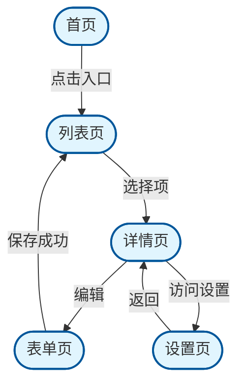
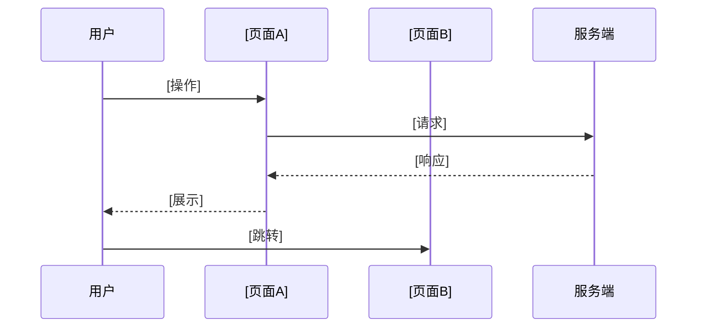

# 页面流程

## 页面清单

> 列出所有页面及其路由、优先级、依赖关系。

| 页面名称 | 路由路径 | 优先级 | 依赖页面 | 说明 |
|----------|----------|--------|----------|------|
| [页面1] | /[route1] | P0/P1/P2 | - | [简短描述] |
| [页面2] | /[route2] | P0/P1/P2 | [依赖页面] | [简短描述] |
| [页面N] | /[routeN] | P0/P1/P2 | - | [简短描述] |

**填写提示**:
- 页面名称: 用户可见的页面标题或功能名称
- 路由路径: URL路径，使用 `:param` 表示动态参数
- 优先级: P0=核心流程, P1=重要功能, P2=辅助功能
- 依赖页面: 当前页面跳转到其他页面时，记录前置依赖

---

## 页面导航流程图

> 使用 Mermaid flowchart 展示页面间的导航关系。



**填写提示**:
- 节点形状: `[文字]` 方角矩形(页面), `([文字])` 圆角矩形(外部入口)
- 连接线: `A -->|跳转条件| B`，条件写在 `| |` 中
- 判断节点: `A -->|条件| B` 后接 `B -->|是| C` 和 `B -->|否| D`
- 常用符号: `-->` 直线跳转, `-.->` 虚线(异步/后台), `-.->>|text|>>` 带注释虚线

### 完整流程图模板

```mermaid
flowchart TD
    %% ============ 节点定义 ============
    Start([开始]):::start
    End([结束]):::end
    
    %% ============ 主流程 ============
    Start -->|用户操作| Action1
    Action1 -->|成功| Action2
    Action1 -->|失败| ErrorHandler
    
    %% ============ 判断分支 ============
    Action2 --> Decision{判断条件}
    Decision -->|条件A| Success([成功结果])
    Decision -->|条件B| Fail([失败结果])
    
    %% ============ 循环处理 ============
    LoopStart[/循环开始/]:::loop
    LoopStart -->|每次迭代| LoopAction
    LoopAction -->|还有数据| LoopStart
    LoopAction -->|处理完成| End
    
    %% ============ 样式定义 ============
    classDef start fill:#c8e6c9,stroke:#2e7d32,stroke-width:3px
    classDef end fill:#ffcdd2,stroke:#c62828,stroke-width:3px
    classDef loop fill:#fff9c4,stroke:#f9a825,stroke-width:1px
```

---

## 用户交互流程

> 描述用户在页面间的操作路径。

### 流程1: [核心流程名称]

**流程图**


**填写提示**:
- `participant` 声明参与者(用户、各页面、服务端)
- `->>` 实线同步请求
- `-->>` 虚线异步响应
- `Note` 可添加注释说明

**步骤说明**

1. **[步骤名称]**: [描述用户行为或系统响应]
   - 入口: [从哪个页面/状态进入]
   - 出口: [流向哪个页面/状态]
   - 预期结果: [成功时的响应]

2. **[步骤名称]**: [描述]
   - 前置条件: [需要满足的条件]
   - 异常处理: [出错时的处理方式]
   - 回退机制: [如何恢复到可用状态]

**边界情况**

| 场景 | 触发条件 | 处理方式 | 反馈用户 |
|------|----------|----------|----------|
| [异常场景1] | [何时触发] | [如何处理] | [显示什么] |
| [异常场景2] | [何时触发] | [如何处理] | [显示什么] |

### 流程2: [流程名称]

> 复制上方模板继续描述更多流程。

---

## 路由配置

> 定义路由与页面组件的映射关系。

```typescript
// 路由配置示例
const routes = {
  '[route_path]': {
    page: '[PageComponent]',
    guards: [],        // 路由守卫: auth, roles, etc.
    meta: {
      title: '[页面标题]',
      requiresAuth: true,
    },
    children: [],      // 子路由
  },
}
```

**填写提示**:
- `guards`: 路由守卫，如 `['auth']`, `['roles:admin']`
- `meta.requiresAuth`: 是否需要登录
- `children`: 嵌套路由配置

### 路由参数说明

| 路由 | 参数名 | 类型 | 来源 | 说明 |
|------|--------|------|------|------|
| /detail/:id | id | string | URL | 资源唯一标识 |
| /user/:userId/edit | userId | string | URL | 用户ID |
| /search | q | string | query | 搜索关键词 |

---

## 页面跳转逻辑汇总

> 汇总所有页面间的跳转关系。

```
[页面A]
    │
    ├──点击操作1──> [页面B] (参数: id, from)
    ├──点击操作2──> [页面C] (参数: type, mode)
    └──系统跳转──> [页面D] (条件: 登录状态)
                        │
                        └──返回──> [页面A]
```

### 跳转参数传递

| 源页面 | 目标页面 | 参数 | 传递方式 | 说明 |
|--------|----------|------|----------|------|
| A | B | id, from | URL/State | 列表项ID和来源页 |
| B | C | token, step | Context | 认证信息和流程步骤 |
| C | A | refresh | URL | 刷新列表标记 |

---

## 状态管理关联

> 描述流程中涉及的状态数据。

### 全局状态

| 状态名 | 类型 | 生命周期 | 说明 |
|--------|------|----------|------|
| user | object | 登录后 | 用户信息 |
| permissions | string[] | 登录后 | 权限列表 |
| [state] | [type] | [scope] | [说明] |

### 页面状态

| 页面 | 状态名 | 初始化来源 | 更新时机 |
|------|--------|------------|----------|
| 列表页 | listData | API/Store | 刷新、筛选、分页 |
| 详情页 | itemDetail | 路由参数/API | 进入时加载 |

---

## 关键节点检查

> 标记关键交互节点，确保流程完整性。

- [ ] **入口检查**: 首次访问是否有引导或默认状态
- [ ] **权限检查**: 无权限时的跳转处理
- [ ] **异常检查**: 网络错误/数据错误的用户反馈
- [ ] **完成检查**: 操作成功后去向哪里
- [ ] **回退检查**: 取消/返回如何处理

---

## 流程图符号约定

| 符号 | Mermaid | 用途 |
|------|---------|------|
| 矩形 | `[text]` | 普通页面/操作 |
| 圆角矩形 | `([text])` | 开始/结束节点 |
| 菱形 | `{text}` | 条件判断 |
| 六边形 | `[[text]]` | 处理程序/函数 |
| 子流程 | `[(text)]` | 包含子流程 |
| 圆柱形 | `[(Database)]` | 数据库/存储 |
| 平行四边形 | `/[text]/` | 输入 |
| 反向平行四边形 | `\]text\[` | 输出 |

---

*最后更新: [日期] | 负责人: [姓名]*
