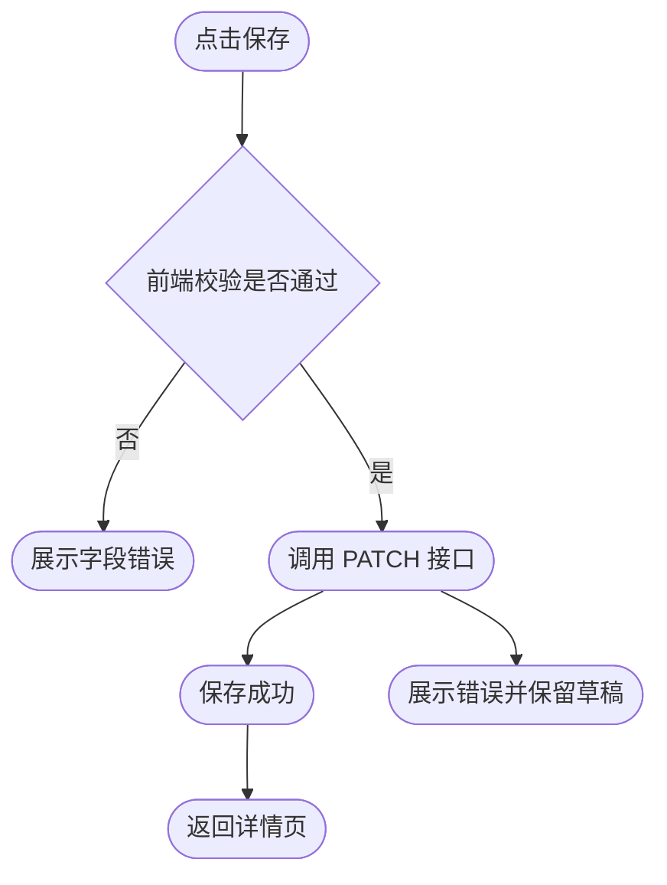

# 页面功能细节（Page Feature Details）
<!-- depends-on: 05-页面流程, 04-设计规范 -->
<!-- required-for: web -->
<!-- generation-order: 5 -->

<!-- AGENT: 本模板用于把页面从“有路由和流程”细化成“可实现的页面规格”。不要把它当作原型说明书；要把每个页面的布局、状态、交互、表单、异常、权限、性能要求写到足够让 Agent 直接继续生成任务与代码。 -->

## 1. 文档目标（Document Goal）

<!-- AGENT: 用 3-5 句话说明该页面集合在整个产品中的角色。必须回答：这些页面服务哪些用户、承接哪些业务流程、与哪些 API/数据模型强关联。 -->

- **页面群概述 Overview**: <!-- AGENT: 例如“本组页面覆盖资源列表、详情、编辑和设置，服务已登录运营人员完成日常业务操作。” -->
- **主要使用者 Primary Users**: <!-- AGENT: 写真实角色，而不是笼统的‘用户’ -->
- **核心价值 Core Value**: <!-- AGENT: 说明这些页面为什么存在 -->

---

## 2. 页面说明清单（Page Specification Index）

<!-- AGENT: 从 05-页面流程 中已定义的页面里选择核心页面，至少完整展开 3 个页面：一个入口/列表页、一个详情/编辑页、一个设置/辅助页。 -->

| 页面名称 Page | 路由 Route | 页面类型 Type | 对应故事 Story | 依赖接口 APIs | 依赖模型 Models |
|---|---|---|---|---|---|
| 仪表盘 Dashboard | `/dashboard` | overview | US-001 | `/stats`, `/me` | User, SummaryMetric |
| 资源列表 Resource List | `/resources` | list | US-002 | `GET /resources` | Resource, Pagination |
| 资源详情 Resource Detail | `/resources/:id` | detail | US-002 | `GET /resources/:id` | Resource |
| 资源编辑 Resource Edit | `/resources/:id/edit` | form | US-003 | `PATCH /resources/:id` | ResourceUpdateInput |
| 设置 Settings | `/settings` | settings | US-004 | `GET /settings`, `PATCH /settings` | UserPreference |

### 2.1 页面选择规则（Selection Rules）

1. 至少覆盖 1 个列表页。
2. 至少覆盖 1 个详情或编辑页。
3. 至少覆盖 1 个辅助页（设置、审计、通知、偏好）。
4. 不允许写“页面 A / 页面 B”这种抽象名称。

---

## 3. 页面级规格模板（Per-Page Spec Template）

<!-- AGENT: 对每个页面都使用以下结构。不要跳章节。若某项不适用，写 `N/A` 并说明原因。 -->

## 页面 A：资源列表页（Example — Resource List Page）

### 3.1 基本信息（Basics）

- **页面名称**: 资源列表页
- **路由**: `/resources`
- **页面类型**: list
- **主要角色**: 已登录运营人员 / 管理员
- **核心任务**: 浏览资源、筛选、搜索、分页、进入详情或创建页
- **前置条件**:
  - 用户已登录
  - 用户拥有查看资源权限
  - 基础筛选项已加载完成

### 3.2 页面布局（Layout Structure）

<!-- AGENT: 布局必须和 04-设计规范 的 spacing / color / component 约束一致。 -->

```text
┌────────────────────────────────────────────────────────────┐
│ Header: 标题 + 操作按钮 + 用户菜单                         │
├────────────────────────────────────────────────────────────┤
│ Filter Bar: 搜索框 | 筛选器 | 排序 | 批量操作              │
├────────────────────────────────────────────────────────────┤
│ Table/List Area                                            │
│  ├─ loading: skeleton rows                                 │
│  ├─ empty: empty state card                                │
│  ├─ error: inline retry block                              │
│  └─ success: rows/cards + pagination                       │
├────────────────────────────────────────────────────────────┤
│ Footer: pagination + totals                                │
└────────────────────────────────────────────────────────────┘
```

### 3.3 视觉区域说明（Visual Zones）

| 区域 Zone | 组成 Elements | 作用 Purpose | 交互要求 |
|---|---|---|---|
| Header | 标题、说明、主按钮 | 确认当前上下文 | 主按钮固定可见 |
| Filter Bar | 搜索框、筛选器、排序 | 缩小结果集 | 过滤条件可回显 |
| Content | 表格或卡片列表 | 展示主数据 | 支持行点击 |
| Footer | 分页、总数 | 导航长列表 | 分页状态与 URL 同步 |

### 3.4 初始加载行为（Initial Load）

1. 读取 URL query 中的筛选参数。
2. 请求列表接口。
3. 同时请求可选的枚举/筛选项数据。
4. 成功后渲染列表与总数；失败则渲染错误态。

### 3.5 用户操作矩阵（User Action Matrix）

| 操作 Action | 触发条件 | 系统行为 | 反馈 | 后续动作 |
|---|---|---|---|---|
| 输入搜索词 | 用户输入并提交 | 重新请求列表 | loading skeleton | 更新 URL query |
| 切换筛选项 | 选择 filter | 重新请求列表 | 顶部结果计数变化 | 重置页码为 1 |
| 点击行 | 选中某项 | 跳转详情页 | 行 hover/active | 进入 `/resources/:id` |
| 点击“新建” | 有创建权限 | 跳转创建页 | 按钮 loading 可选 | 进入 `/resources/new` |
| 切换分页 | 点击下一页 | 请求新页数据 | 页脚 loading | 保留筛选条件 |

### 3.6 状态定义（State Model）

| 状态名 State | 类型 | 来源 | 生命周期 | 说明 |
|---|---|---|---|---|
| `query` | object | URL query | route-level | 搜索和筛选参数 |
| `items` | array | API | page-level | 当前页列表数据 |
| `total` | number | API | page-level | 总记录数 |
| `isLoading` | boolean | request lifecycle | page-level | 是否加载中 |
| `error` | string\|null | request lifecycle | page-level | 错误提示 |

### 3.7 异常和边界（Edge Cases）

| 场景 | 用户看到 | 系统处理 | 恢复策略 |
|---|---|---|---|
| 无数据 | 空状态插图 + CTA | 不显示表格 | 提供“新建”按钮 |
| 请求失败 | 错误卡片 | 保留筛选参数 | 点击重试 |
| 无权限 | 禁止访问提示 | 阻止请求或跳 403 | 返回仪表盘 |
| URL 参数非法 | 默认参数回退 | 清洗 query | 更新 URL |

### 3.8 与下游代码的约束（Implementation Constraints）

- 列表页必须有稳定的 loading / empty / error / success 四态。
- 分页参数必须可序列化到 URL。
- 批量操作必须明确说明是否支持，若不支持写明原因。

---

## 页面 B：资源详情页（Example — Resource Detail Page）

### 4.1 基本信息（Basics）

- **路由**: `/resources/:id`
- **页面类型**: detail
- **主要角色**: 需要查看单资源完整信息的用户
- **核心任务**: 查看详情、查看相关信息、进入编辑、执行次级操作

### 4.2 布局结构（Layout）

```text
Header: 返回按钮 + 标题 + 操作区（编辑 / 删除 / 更多）
Summary Panel: 核心字段摘要
Tabs: 基本信息 / 历史记录 / 关联资源 / 审计日志
Side Panel: 状态、负责人、更新时间、标签
```

### 4.3 数据依赖（Data Dependencies）

| 数据 | 接口 | 必须性 | 说明 |
|---|---|---|---|
| 主体详情 | `GET /resources/:id` | required | 页面主数据 |
| 历史记录 | `GET /resources/:id/history` | optional | tab 懒加载 |
| 审计日志 | `GET /resources/:id/audit` | optional | 权限控制 |

### 4.4 页面行为（Page Behaviour）

1. 通过 `id` 拉取主数据。
2. 主数据成功后渲染摘要卡片和页签。
3. 次级 tab 使用懒加载，避免首次过重。
4. 编辑按钮仅在拥有权限时显示。

### 4.5 用户操作矩阵（Action Matrix）

| 操作 | 条件 | 行为 | 反馈 |
|---|---|---|---|
| 返回列表 | 任意时刻 | `back` 或 route push | 还原筛选来源 |
| 点击编辑 | 有编辑权限 | 跳转编辑页 | 按钮可见且可用 |
| 切换 tab | 数据已存在 | 懒加载附加数据 | tab active |
| 删除资源 | 有删除权限 | 二次确认后请求 delete | toast + redirect |

### 4.6 失败场景（Failure Modes）

- `id` 不存在 → 404 页面
- 主接口 500 → 错误态 + 重试按钮
- 子 tab 请求失败 → 局部错误，不影响主详情
- 权限不足 → 隐藏按钮或跳转 403

---

## 页面 C：资源编辑页（Example — Resource Edit Page）

### 5.1 基本信息（Basics）

- **路由**: `/resources/:id/edit`
- **页面类型**: form
- **核心任务**: 修改资源字段并安全提交

### 5.2 表单结构（Form Structure）

| 区块 Section | 字段 | 说明 |
|---|---|---|
| 基本信息 | title, description, status | 核心业务字段 |
| 扩展信息 | tags, owner, category | 业务扩展字段 |
| 风险信息 | note, reason | 某些状态切换时必填 |

### 5.3 字段定义（Field Definition Rules）

<!-- AGENT: 字段必须来源于 07-数据库设计 或 03-接口文档，不能凭空创造。 -->

| 字段 | 类型 | 必填 | 来源 | 校验 |
|---|---|---|---|---|
| `title` | string | yes | model/resource.title | 1-100 字 |
| `description` | string | no | model/resource.description | 最长 2000 字 |
| `status` | enum | yes | model/resource.status | 必须是允许的流转值 |
| `ownerId` | string | conditional | relation/user | 必须是有效用户 |

### 5.4 校验时机（Validation Timing）

- 输入中：只做轻量格式提示
- 失焦时：做单字段校验
- 提交时：做完整业务校验
- 服务端返回错误时：回填字段级错误 + 顶部 summary

### 5.5 提交流程（Submission Flow）



### 5.6 草稿与离开保护（Unsaved Changes Guard）

- 页面需要 `isDirty` 状态。
- 若表单已修改且未保存，离开页面时弹出确认。
- 提交成功后清空 dirty 状态。

### 5.7 提交失败策略（Submit Failure Strategy）

| 失败类型 | 展示方式 | 保留输入 | 后续动作 |
|---|---|---|---|
| 422 校验错误 | 字段级错误 + summary | 是 | 修正重提 |
| 409 资源冲突 | 顶部冲突提示 | 是 | 提示刷新 |
| 500 服务端错误 | toast + inline block | 是 | 允许重试 |

---

## 页面 D：设置页（Example — Settings Page）

### 6.1 页面目标（Goal）

- 修改个人偏好
- 查看账户信息
- 管理通知和安全选项

### 6.2 结构（Structure）

| 区块 | 内容 | 是否立即生效 |
|---|---|---|
| 个人资料 | 姓名、头像、时区 | 否，保存后生效 |
| 界面偏好 | 主题、列表密度、默认排序 | 可立即预览 |
| 通知偏好 | 邮件/站内通知 | 保存后生效 |
| 安全设置 | 密码修改、设备登出 | 特殊流程 |

### 6.3 页面规则（Rules）

- 偏好类字段允许局部保存。
- 安全敏感操作必须二次确认。
- 某些字段修改后需重新加载会话。

---

## 7. 通用交互约束（Shared Interaction Rules）

<!-- AGENT: 所有页面都要遵守。 -->

### 7.1 Loading / Empty / Error / Success 四态

每个页面都必须明确以下四态：

| 状态 | 要求 |
|---|---|
| loading | 使用 skeleton 或局部 loading，不要整页闪烁 |
| empty | 给出空状态说明和下一步动作 |
| error | 给出可恢复方式（重试/返回/联系管理员） |
| success | 给出操作完成反馈（toast/inline/redirect） |

### 7.2 权限约束

- 无权限页面：直接 403 或只读模式，必须二选一并写明。
- 按钮级权限：隐藏或禁用策略要一致。
- 不能只写“根据权限处理”，必须写具体行为。

### 7.3 可访问性（Accessibility）

- 所有可点击元素要有清晰标签。
- 表单错误必须可被屏幕阅读器感知。
- 键盘导航顺序要符合视觉顺序。

---

## 8. 页面与 API / 数据模型映射（Page → API / Model Mapping）

| 页面 | 关键接口 | 关键模型 | 说明 |
|---|---|---|---|
| Dashboard | `/stats`, `/me` | SummaryMetric, User | 首页总览 |
| Resource List | `GET /resources` | Resource, Pagination | 列表数据 |
| Resource Detail | `GET /resources/:id` | Resource | 单条详情 |
| Resource Edit | `PATCH /resources/:id` | ResourceUpdateInput | 更新写入 |
| Settings | `GET/PATCH /settings` | UserPreference | 偏好配置 |

### 8.1 一致性规则（Consistency Rules）

1. 页面字段名称应尽量和 API 字段名一致。
2. 若 UI 文案和字段名不同，必须写映射说明。
3. 页面中的筛选/排序能力必须能在 API 文档中找到对应参数。

---

## 9. 性能与体验要求（Performance & UX Requirements）

| 指标 | 建议目标 | 适用页面 |
|---|---|---|
| 首屏可交互 | ≤ 2.5s | Dashboard, List |
| 翻页响应 | ≤ 300ms | List |
| 表单提交反馈 | ≤ 150ms 显示 loading | Edit, Settings |
| 详情切换 | ≤ 500ms | Detail |

### 9.1 体验规则（UX Rules）

- 列表页搜索不应阻塞输入。
- 详情页次级内容优先懒加载。
- 表单页提交期间禁用重复提交。

---

## 10. Agent 生成检查表（Agent Completion Checklist）

- [ ] 每个核心页面都写了基本信息、布局、状态、操作、异常
- [ ] 每个页面都能映射到 05-页面流程 中已存在的路由
- [ ] 每个页面都能映射到至少一个 API 操作
- [ ] 表单页写清校验时机与失败策略
- [ ] 没有残留“功能名称/字段A/描述”之类占位写法

---

## 11. 修订记录（Revision Log）

| 版本 Version | 日期 Date | 修改人 Owner | 修改内容 Notes |
|---|---|---|---|
| 2.0 | <!-- AGENT: 填当前日期 --> | <!-- AGENT: 填当前执行 Agent/作者 --> | 重构为 Agent 可执行页面功能细节模板 |

## 12. 生成后自检提示（Post-Generation Self Review）

<!-- AGENT: 生成完成后，最后再做一次横向检查：页面名、路由名、状态名、接口名是否与 05-页面流程 / 03-接口文档 / 07-数据库设计 保持一致。任何不一致都必须在输出前修正。 -->
