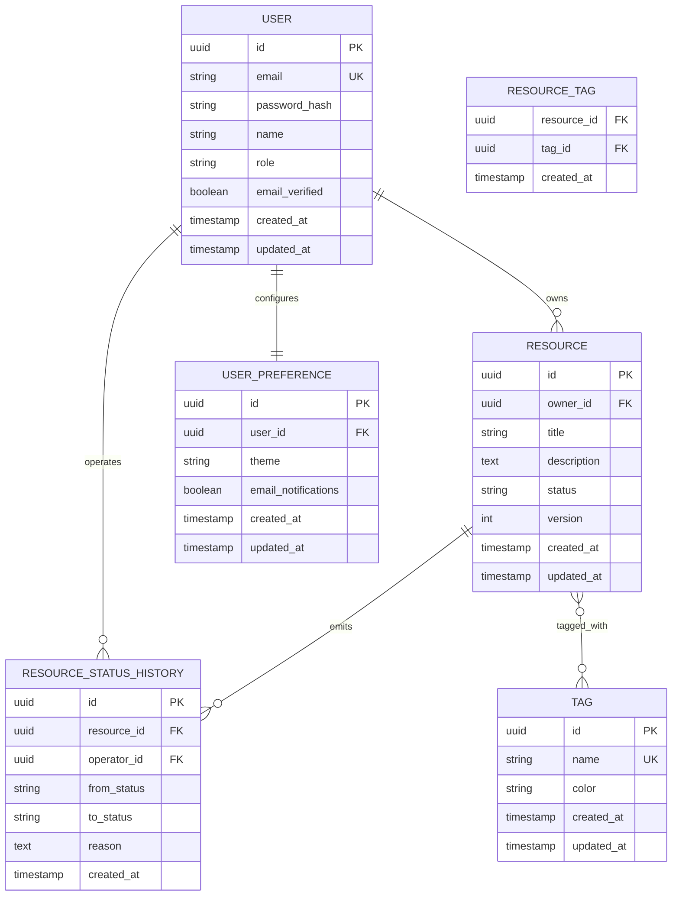
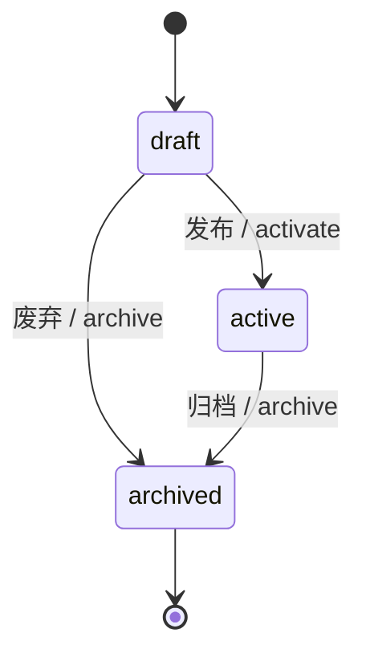

# 数据库设计（Database Design）
<!-- depends-on: 01-需求文档 -->
<!-- required-for: web, api -->
<!-- generation-order: 3 -->

<!-- AGENT: 本模板不是“讲数据库概念”的说明文，而是供 Agent 直接落地 schema / migration / seed / API-model mapping 的执行契约。必须从 01-需求文档 的用户故事、验收标准、场景、非功能要求中推导真实实体、关系、约束、索引、迁移和数据初始化规则。禁止保留“实体A/字段B/表1”这类弱占位。 -->

## 1. 文档目标（Document Goal）

<!-- AGENT: 用 3-5 句话总结该项目的数据模型边界。必须回答：系统管理哪些核心对象、哪些对象是主数据、哪些对象是关系/事件/配置数据、哪些数据需要审计或软删除。 -->

- **数据域概述 Data Domain Overview**: <!-- AGENT: 例如“系统围绕用户、资源、资源状态流转、偏好配置和审计记录建模。” -->
- **主数据 Core Records**: <!-- AGENT: 写真实实体名，来自 P0/P1 用户故事 -->
- **高风险数据 High-Risk Data**: <!-- AGENT: 如认证凭证、支付记录、角色权限、隐私字段；如无写 N/A -->
- **下游消费者 Downstream Consumers**: `03-接口文档`、`05-页面流程`、`06-页面功能细节`、`10-测试策略`

### 1.1 生成边界（Generation Boundaries）

1. 本文档必须只描述持久化数据，不描述纯前端临时 state。
2. 每个 P0 用户故事至少映射到 1 个实体、视图、关联表或事件表；若无持久化需求，必须显式写 `No persistent storage required`。
3. 所有字段、枚举、关系、唯一约束都必须可追溯到 `01-需求文档`、`03-接口文档` 或明确的非功能要求。
4. 若项目为 CLI 工具但有本地配置/缓存/任务历史，也应在本文档中建模；若完全无数据库，则仍需产出“无需数据库”的裁定和替代存储策略。
5. 不允许把“待讨论”“后续补充”“视情况而定”留在最终输出；必须给出当前方案或明确 `N/A + 原因`。

---

## 2. 数据库概览（Database Overview）

<!-- AGENT: 从 01-需求文档、02-技术架构 或访谈结果中提取最终数据库选型。所有值必须是最终答案，不要保留候选项。 -->

| 配置项 Config | 值 Value | 生成规则 Generation Rule |
|---|---|---|
| 数据库类型 Type | <!-- AGENT: 如 `PostgreSQL 15+` / `MySQL 8+` / `SQLite` --> | 必须与部署和 ORM 兼容 |
| ORM / Query Layer | <!-- AGENT: 如 `Prisma 5.x` / `Drizzle ORM` / `TypeORM` / `SQLAlchemy` --> | 必须与 02-技术架构 一致 |
| 字符集 Charset | `utf8mb4` 或数据库等效值 | 不允许留空 |
| 时区策略 Timezone Strategy | <!-- AGENT: 如 `全部以 UTC 存储，展示层转换` --> | 必须与 API 时间字段一致 |
| 主键策略 Primary Key Strategy | <!-- AGENT: 如 `UUID v4` / `ULID` / `BIGINT` --> | 所有表统一或说明例外 |
| 删除策略 Deletion Strategy | <!-- AGENT: 如 `业务表软删除 + 审计表硬删除禁止` --> | 必须写清是否存在 `deleted_at` |
| 连接池 Pool | <!-- AGENT: 如 `min: 2, max: 10` --> | 根据吞吐和部署模式给出 |
| 迁移工具 Migration Tool | <!-- AGENT: 如 `Prisma Migrate` / `Drizzle Kit` --> | 必须和 ORM 协同 |
| 种子数据入口 Seed Entry | <!-- AGENT: 如 `prisma/seed.ts` --> | 必须能被测试和本地开发复用 |

### 2.1 Agent 生成硬规则（Agent Hard Rules）

1. 若项目包含认证，则必须明确用户表、会话表/令牌表是否存在。
2. 若存在“状态流转”“审批”“支付”“库存”“配额”等业务，必须建模状态字段和流转约束。
3. 若存在多租户/组织边界，必须明确 `tenant_id` / `organization_id` 的隔离策略。
4. 若需求中出现“审计”“追踪”“日志可回放”，必须增加审计表或事件表，而不是只写应用日志。
5. 若需求中出现“偏好”“设置”“草稿”“模板”，必须区分是用户级、组织级还是全局级数据。

### 2.2 下游契约（Downstream Contract）

- `03-接口文档` 必须使用本文档中的真实实体名、字段名、枚举值和关系名称。
- `05-页面流程` 中涉及 `:id`、筛选、排序、状态切换的页面，必须能映射到本文档的字段或关系。
- `06-页面功能细节` 中所有表单字段必须能追溯到本文档字段或接口 DTO 映射，不得凭空造字段。
- `10-测试策略` 必须基于本文档的实体约束生成 CRUD、权限、迁移、种子数据、并发和数据一致性测试。

---

## 3. 实体推导矩阵（Entity Derivation Matrix）

<!-- AGENT: 本节是核心契约。必须先完成本节，再生成 ER 图与表结构。每个实体都必须说明来源故事、实体类型、生命周期、是否可独立存在。 -->

| 实体 Entity | 来源故事 Source Stories | 实体类型 Kind | 持久化原因 Persistence Rationale | 生命周期 Lifecycle | 是否独立存在 Standalone |
|---|---|---|---|---|---|
| `User` | `US-001`, `US-005` | 主实体 Primary | 认证、归属、偏好关联 | 长生命周期 | yes |
| `Resource` | `US-002`, `US-003` | 主实体 Primary | 核心业务对象 | 长生命周期 | yes |
| `ResourceStatusHistory` | `US-003`, `AC-00x` | 事件/审计 Event | 记录状态流转和责任人 | 追加写入 | no |
| `UserPreference` | `US-005` | 配置 Config | 保存个性化设置 | 长生命周期 | no |

### 3.1 实体推导规则（Entity Derivation Rules）

1. **从名词提取实体 Extract entities from nouns**：用户故事中的稳定业务对象通常是实体；一次性动作通常不是实体。
2. **从动词提取事件/关系 Extract events/relations from verbs**：如“加入成员”“分享资源”“状态变更”“审批通过”应优先评估为关系表或事件表。
3. **从约束提取字段 Extract fields from rules**：验收标准中的唯一性、时间窗、状态限制、权限归属都必须落到字段、索引或检查约束。
4. **从 UI/API 逆推字段 Reverse-map from UI/API**：页面筛选项、排序项、详情展示字段、写接口入参必须能在实体字段中找到来源。
5. **从 NFR 推导技术字段 Derive technical fields from NFRs**：如审计、软删除、幂等、并发控制、追踪 ID、版本号等。

### 3.2 实体裁定规则（Entity Inclusion / Exclusion Rules）

| 场景 Scenario | 建议做法 Required Decision |
|---|---|
| 仅用于前端展示排序或本地 UI 切换 | 不建表；在页面状态中处理 |
| 需要跨会话保存、跨用户共享或可审计 | 建表或写入事件表 |
| 多对多关系附带额外字段 | 必须单独建中间表，不可隐藏在 ORM relation shorthand |
| 单一枚举列表且无需动态配置 | 使用 enum / check constraint / 常量表之一，并说明理由 |
| 需要运营可配置的选项集 | 建配置表，不要写死在代码枚举里 |

### 3.3 Story → Entity → API → Page 映射（Mandatory Mapping）

| 用户故事 Story | 实体 / 关系 Entities | API 操作 API Operations | 页面/路由 Pages / Routes | 说明 Notes |
|---|---|---|---|---|
| `US-001 用户注册和登录` | `User`, `Session`/`RefreshToken` | `POST /auth/register`, `POST /auth/login` | `/login`, `/register` | 认证数据边界 |
| `US-002 浏览资源列表` | `Resource`, `Tag?`, `Pagination meta` | `GET /resources`, `GET /resources/:id` | `/resources`, `/resources/:id` | 列表/详情映射 |
| `US-003 编辑资源` | `Resource`, `ResourceStatusHistory` | `PATCH /resources/:id` | `/resources/:id/edit` | 写入与审计映射 |
| `US-005 修改设置` | `UserPreference` | `GET/PATCH /settings` | `/settings` | 配置类数据 |

### 3.4 Agent Completion Check for Derivation

- [ ] 每个 P0 用户故事至少映射到 1 个实体或关系
- [ ] 每个需要持久化的页面字段都能映射到真实字段
- [ ] 每个写接口都能映射到实体写入动作
- [ ] 没有保留“实体A/表B/字段X”类占位文本

---

## 4. ER 图（Entity Relationship Diagram）

<!-- AGENT: 使用 Mermaid `erDiagram`。图中的实体名必须与 3. 实体推导矩阵完全一致。每个实体至少包含主键、一个核心字段、时间戳字段；如不需要 `updated_at`，必须说明原因。 -->



### 4.1 图生成规则（Diagram Rules）

1. 图中的每条关系都必须在后续表结构中出现外键或中间表实现。
2. 所有 M:N 关系必须落地为中间表，即使 ORM 支持隐式 relation，也要显式说明底层结构。
3. 关系命名使用真实业务语义，如 `owns` / `belongs_to` / `approved_by`，禁止 `relates_to` 这类空泛描述。
4. 若存在软删除，ER 图中可不显式展示 `deleted_at`，但表结构定义中必须补充。
5. 如项目使用文档数据库，也要给出等价的“集合与引用关系图”，并保留本节标题结构。

---

## 5. 表结构定义（Table Definitions）

<!-- AGENT: 为每个真实实体生成完整定义。必须按“核心字段 → 约束 → 索引 → 外键 → 写入规则 → 读路径影响”展开，而不是仅列字段。若某项目表很多，至少完整写出所有 P0/P1 核心表。 -->

### 5.1 表级编写规则（Table Definition Rules）

1. 每张表必须说明其服务的用户故事和 API/page 入口。
2. 每个字段都必须给出：类型、是否必填、默认值、约束、业务说明。
3. 每张表必须显式说明索引策略；若无额外索引，必须写“仅主键索引，原因是…”。
4. 每张表必须说明是否允许软删除、是否需要审计、是否需要乐观锁/版本号。
5. 每张表必须说明与 ORM 命名映射（snake_case / camelCase）的一致性策略。

### 5.2 users 表（若存在认证）

**来源故事 Source Stories**: `US-001`, `US-005`  
**关联 API / 页面 Related APIs / Pages**: `/auth/*`, `/settings`, `/me`

| 字段名 Column | 类型 Type | 约束 Constraints | 默认值 Default | 说明 Description |
|---|---|---|---|---|
| `id` | `uuid` | PK | `gen_random_uuid()` | 主键 |
| `email` | `varchar(255)` | UNIQUE, NOT NULL | - | 登录邮箱 |
| `password_hash` | `varchar(255)` | NOT NULL | - | 哈希后的密码 |
| `name` | `varchar(100)` | NOT NULL | - | 显示名称 |
| `avatar_url` | `varchar(500)` | NULL | `NULL` | 头像地址 |
| `role` | `varchar(20)` | NOT NULL | `'user'` | 角色枚举 |
| `email_verified` | `boolean` | NOT NULL | `false` | 邮箱是否已验证 |
| `last_login_at` | `timestamptz` | NULL | `NULL` | 最近登录时间 |
| `created_at` | `timestamptz` | NOT NULL | `now()` | 创建时间 |
| `updated_at` | `timestamptz` | NOT NULL | `now()` | 更新时间 |
| `deleted_at` | `timestamptz` | NULL | `NULL` | 软删除时间；若项目不做软删除则删除此列并写明原因 |

**索引 Indexes**

| 索引名 | 字段 | 类型 | 说明 |
|---|---|---|---|
| `users_email_key` | `email` | UNIQUE | 登录查找 |
| `users_role_idx` | `role` | BTREE | 角色过滤 |
| `users_deleted_at_idx` | `deleted_at` | BTREE / partial | 软删除过滤（如适用） |

**外键 / 关联 Foreign Keys / Relations**

| 关联对象 | 类型 | 说明 |
|---|---|---|
| `user_preferences.user_id` | 1:1 | 用户偏好 |
| `resources.owner_id` | 1:N | 用户拥有资源 |
| `resource_status_history.operator_id` | 1:N | 用户触发状态变更 |

**写入规则 Write Rules**

- `email` 必须大小写归一化后再写入。
- `password_hash` 永远不可通过读接口返回。
- `role` 只能取数据字典中定义的枚举值。
- 若使用软删除，删除后 `email` 是否允许复用必须在本节明确说明。

**对 API / 页面影响 Impact on APIs / Pages**

- 登录页、注册页、设置页、权限校验、审计日志都依赖本表。
- `03-接口文档` 中凡是返回用户对象，都必须说明脱敏字段策略。

### 5.3 resources 表（示例核心业务表）

**来源故事 Source Stories**: `US-002`, `US-003`  
**关联 API / 页面 Related APIs / Pages**: `GET /resources`, `GET /resources/:id`, `PATCH /resources/:id`, `/resources*`

| 字段名 Column | 类型 Type | 约束 Constraints | 默认值 Default | 说明 Description |
|---|---|---|---|---|
| `id` | `uuid` | PK | `gen_random_uuid()` | 主键 |
| `owner_id` | `uuid` | FK, NOT NULL | - | 所属用户/组织 |
| `title` | `varchar(200)` | NOT NULL | - | 标题 |
| `description` | `text` | NULL | `NULL` | 描述 |
| `status` | `varchar(30)` | NOT NULL | `'draft'` | 状态枚举 |
| `slug` | `varchar(120)` | UNIQUE / conditional | `NULL` | 可选业务标识 |
| `version` | `integer` | NOT NULL | `1` | 乐观锁版本号 |
| `published_at` | `timestamptz` | NULL | `NULL` | 发布时间 |
| `created_at` | `timestamptz` | NOT NULL | `now()` | 创建时间 |
| `updated_at` | `timestamptz` | NOT NULL | `now()` | 更新时间 |
| `deleted_at` | `timestamptz` | NULL | `NULL` | 软删除时间 |

**索引 Indexes**

| 索引名 | 字段 | 类型 | 说明 |
|---|---|---|---|
| `resources_owner_id_idx` | `owner_id` | BTREE | 按归属查询 |
| `resources_status_idx` | `status` | BTREE | 列表筛选 |
| `resources_owner_status_idx` | `owner_id, status` | BTREE | 常见组合过滤 |
| `resources_created_at_idx` | `created_at DESC` | BTREE | 列表默认排序 |
| `resources_title_search_idx` | `title` | FULLTEXT / GIN / trigram | 关键字搜索（按数据库能力选择） |

**外键 Foreign Keys**

| 字段 | 引用表 | 引用字段 | 删除策略 On Delete | 更新策略 On Update |
|---|---|---|---|---|
| `owner_id` | `users` | `id` | `RESTRICT` / `SET NULL` / `CASCADE`（必须择一并说明） | `CASCADE` |

**业务约束 Business Constraints**

- `status` 必须符合数据字典中的允许值。
- 若 `status = 'published'`，则 `published_at` 必须非空。
- 若支持并发编辑，`PATCH` 接口必须依赖 `version` 或 `updated_at` 做乐观锁控制。
- 列表接口中所有筛选/排序字段都必须来自本表或其明确的关联表。

**页面映射 Page Mapping**

| 页面 | 读取字段 | 写入字段 | 说明 |
|---|---|---|---|
| `/resources` | `id`, `title`, `status`, `owner_id`, `created_at` | - | 列表最小展示集 |
| `/resources/:id` | 除敏感字段外全部业务字段 | - | 详情展示 |
| `/resources/:id/edit` | 当前值回填所有可编辑字段 | `title`, `description`, `status`... | 编辑表单来源 |

### 5.4 user_preferences 表（配置类表）

**来源故事 Source Stories**: `US-005`  
**关联 API / 页面 Related APIs / Pages**: `/settings`, `/me/preferences`

| 字段名 Column | 类型 Type | 约束 Constraints | 默认值 Default | 说明 Description |
|---|---|---|---|---|
| `id` | `uuid` | PK | `gen_random_uuid()` | 主键 |
| `user_id` | `uuid` | UNIQUE, FK, NOT NULL | - | 一用户一份偏好 |
| `theme` | `varchar(20)` | NOT NULL | `'system'` | 主题设置 |
| `locale` | `varchar(10)` | NOT NULL | `'zh-CN'` | 语言/地区 |
| `email_notifications` | `boolean` | NOT NULL | `true` | 邮件通知 |
| `items_per_page` | `integer` | NOT NULL | `20` | 默认分页大小 |
| `created_at` | `timestamptz` | NOT NULL | `now()` | 创建时间 |
| `updated_at` | `timestamptz` | NOT NULL | `now()` | 更新时间 |

**表级规则 Table Rules**

- 偏好字段必须有默认值，保证首次登录即可渲染 UI。
- 所有偏好值必须能直接映射到页面层实际使用的配置项。
- 如果某偏好立即生效，接口设计必须允许返回更新后的完整偏好对象。

### 5.5 resource_status_history 表（事件 / 审计表）

**来源故事 Source Stories**: `US-003`，状态变更相关 AC  
**关联 API / 页面 Related APIs / Pages**: 审计日志、详情页历史、状态变更接口

| 字段名 Column | 类型 Type | 约束 Constraints | 默认值 Default | 说明 Description |
|---|---|---|---|---|
| `id` | `uuid` | PK | `gen_random_uuid()` | 主键 |
| `resource_id` | `uuid` | FK, NOT NULL | - | 资源 |
| `operator_id` | `uuid` | FK, NOT NULL | - | 操作人 |
| `from_status` | `varchar(30)` | NULL | `NULL` | 原状态 |
| `to_status` | `varchar(30)` | NOT NULL | - | 目标状态 |
| `reason` | `text` | NULL | `NULL` | 变更原因 |
| `metadata` | `jsonb` | NULL | `NULL` | 扩展上下文 |
| `created_at` | `timestamptz` | NOT NULL | `now()` | 发生时间 |

**规则 Rules**

- 该表为追加写入 append-only，不允许更新历史记录。
- 若主表支持状态流转，必须同步维护该表，不能只改主表 `status`。
- 审计/历史页必须明确读取该表而非根据日志推断。

### 5.6 其他核心表（Other Required Core Tables）

<!-- AGENT: 若项目还有会话、订单、支付、组织、成员、任务、评论、附件、草稿、Webhook 事件等核心表，按 5.2-5.5 相同粒度继续补齐。不得只写标题。 -->

---

## 6. 字段与命名一致性契约（Field & Naming Consistency Contract）

<!-- AGENT: 本节用于约束 DB 字段、ORM 字段、API 字段、页面字段的一致性，避免多模板之间命名漂移。 -->

| 数据库字段 DB Column | ORM 字段 ORM Field | API 字段 API Field | 页面字段 UI Field | 说明 Notes |
|---|---|---|---|---|
| `password_hash` | `passwordHash` | `N/A` | `N/A` | 敏感字段，不直接返回 |
| `email_verified` | `emailVerified` | `emailVerified` | `emailVerified` | 布尔状态一致 |
| `created_at` | `createdAt` | `createdAt` | `createdAt` / 展示文案 | 时间字段统一 |
| `owner_id` | `ownerId` | `ownerId` | `ownerId` | 归属关系字段 |
| `items_per_page` | `itemsPerPage` | `itemsPerPage` | `itemsPerPage` | 偏好配置一致 |

### 6.1 ORM 一致性规则（ORM Consistency Rules）

1. 数据库列名默认使用 `snake_case`；ORM/代码字段默认使用 `camelCase`；必须通过显式 mapping 保持一一对应。
2. `03-接口文档` 的响应字段命名优先与 ORM/业务对象一致，除非已有明确外部契约；若不同，必须在此表记录映射。
3. 不允许同一语义在不同文档中出现 `ownerId` / `userId` / `createdBy` 混用，除非它们确实表示不同含义。
4. 所有时间字段统一使用 ISO 8601 / UTC 语义，与数据库时区策略一致。
5. 所有枚举值必须在数据库约束、ORM 类型、API Schema、页面状态机中完全一致。

### 6.2 敏感字段规则（Sensitive Field Rules）

- 敏感字段必须标记为“仅写入 / 仅内部使用 / 脱敏返回 / 禁止返回”。
- 常见敏感字段包括：密码哈希、刷新令牌、支付凭证、个人身份信息、内部风控字段。
- 若某字段仅用于内部计算，必须在 `03-接口文档` 明确不暴露。

---

## 7. ORM Schema 定义（ORM Schema）

<!-- AGENT: 只生成与当前项目 ORM 匹配的最终版本；其他 ORM 示例可保留为参考，但最终输出必须明确“本项目采用哪一种”。生成代码片段时必须与 5. 表结构完全一致。 -->

### 7.1 生成规则（ORM Generation Rules）

1. ORM schema 必须覆盖所有真实实体、中间表、索引、唯一约束、默认值、关系、枚举。
2. ORM 中的 relation 名称必须可读且和业务语义一致，禁止使用 `relation1`、`items2`。
3. 对于数据库默认值、触发器、check constraint，若 ORM 无法完整表达，必须在本节或迁移章节补充 SQL 级声明。
4. ORM schema 中不得凭空增加数据库定义中不存在的字段。
5. ORM schema 中如使用别名/映射注解，必须与 6. 一致性契约一致。

### 7.2 Prisma Schema 格式（Prisma Example）

```prisma
// prisma/schema.prisma

generator client {
  provider = "prisma-client-js"
}

datasource db {
  provider = "postgresql"
  url      = env("DATABASE_URL")
}

enum UserRole {
  user
  admin
}

enum ResourceStatus {
  draft
  active
  archived
}

model User {
  id             String               @id @default(uuid())
  email          String               @unique
  passwordHash   String               @map("password_hash")
  name           String
  avatarUrl      String?              @map("avatar_url")
  role           UserRole             @default(user)
  emailVerified  Boolean              @default(false) @map("email_verified")
  lastLoginAt    DateTime?            @map("last_login_at")
  createdAt      DateTime             @default(now()) @map("created_at")
  updatedAt      DateTime             @updatedAt @map("updated_at")
  deletedAt      DateTime?            @map("deleted_at")

  resources      Resource[]
  preferences    UserPreference?
  statusHistories ResourceStatusHistory[] @relation("ResourceStatusOperator")

  @@map("users")
}

model Resource {
  id              String                @id @default(uuid())
  ownerId         String                @map("owner_id")
  title           String
  description     String?
  status          ResourceStatus        @default(draft)
  slug            String?               @unique
  version         Int                   @default(1)
  publishedAt     DateTime?             @map("published_at")
  createdAt       DateTime              @default(now()) @map("created_at")
  updatedAt       DateTime              @updatedAt @map("updated_at")
  deletedAt       DateTime?             @map("deleted_at")

  owner           User                  @relation(fields: [ownerId], references: [id], onDelete: Restrict)
  tags            ResourceTag[]
  statusHistories ResourceStatusHistory[]

  @@index([ownerId])
  @@index([status])
  @@index([ownerId, status])
  @@map("resources")
}

model UserPreference {
  id                 String   @id @default(uuid())
  userId             String   @unique @map("user_id")
  theme              String   @default("system")
  locale             String   @default("zh-CN")
  emailNotifications Boolean  @default(true) @map("email_notifications")
  itemsPerPage       Int      @default(20) @map("items_per_page")
  createdAt          DateTime @default(now()) @map("created_at")
  updatedAt          DateTime @updatedAt @map("updated_at")

  user User @relation(fields: [userId], references: [id], onDelete: Cascade)

  @@map("user_preferences")
}

model ResourceStatusHistory {
  id         String   @id @default(uuid())
  resourceId String   @map("resource_id")
  operatorId String   @map("operator_id")
  fromStatus String?  @map("from_status")
  toStatus   String   @map("to_status")
  reason     String?
  metadata   Json?
  createdAt  DateTime @default(now()) @map("created_at")

  resource Resource @relation(fields: [resourceId], references: [id], onDelete: Cascade)
  operator User     @relation("ResourceStatusOperator", fields: [operatorId], references: [id], onDelete: Restrict)

  @@index([resourceId, createdAt])
  @@map("resource_status_history")
}

model ResourceTag {
  resourceId String   @map("resource_id")
  tagId      String   @map("tag_id")
  createdAt  DateTime @default(now()) @map("created_at")

  resource Resource @relation(fields: [resourceId], references: [id], onDelete: Cascade)
  tag      Tag      @relation(fields: [tagId], references: [id], onDelete: Cascade)

  @@id([resourceId, tagId])
  @@map("resource_tag")
}

model Tag {
  id        String        @id @default(uuid())
  name      String        @unique
  color     String?
  createdAt DateTime      @default(now()) @map("created_at")
  updatedAt DateTime      @updatedAt @map("updated_at")

  resources ResourceTag[]

  @@map("tags")
}
```

### 7.3 Drizzle / TypeORM / 其他 ORM（Other ORM Notes）

<!-- AGENT: 若项目不用 Prisma，则在此处给出实际 ORM 的完整等价 schema；保留必要示例，但最终必须把“当前采用方案”写清。 -->

---

## 8. 数据字典（Data Dictionary）

<!-- AGENT: 枚举、状态机、常量取值、布尔语义都在此统一定义。API、页面、测试必须共享这份字典。 -->

### 8.1 枚举值定义（Enum Definitions）

**user_role（用户角色）**

| 值 Value | 说明 Description | 使用位置 Usage |
|---|---|---|
| `user` | 普通用户 | 认证、权限、页面守卫 |
| `admin` | 管理员 | 管理接口、后台功能 |

**resource_status（资源状态）**

| 值 Value | 说明 Description | 可转换到 Can Transition To | 强制规则 Hard Rule |
|---|---|---|---|
| `draft` | 草稿 | `active`, `archived` | 草稿可编辑 |
| `active` | 生效中 | `archived` | 必须满足发布前校验 |
| `archived` | 已归档 | - | 默认只读 |

### 8.2 状态流转图（State Machine）



### 8.3 枚举使用契约（Enum Usage Contract）

1. 枚举值必须在数据库约束、ORM 类型、API schema、页面表单选项、测试断言中完全一致。
2. 若某状态转换需要额外字段（如 `reason`、`approved_by`、`published_at`），必须在表结构中体现。
3. 不允许页面显示文案直接替代底层枚举值；文案应通过映射层转换。

---

## 9. 迁移策略（Migration Strategy）

<!-- AGENT: 本节必须强于“列命令”。需要写清版本化、顺序、回滚、兼容性、多人协作规则。 -->

### 9.1 迁移配置（Migration Configuration）

| 配置项 | 值 |
|---|---|
| 工具 Tool | <!-- AGENT: 如 `Prisma Migrate` --> |
| 迁移目录 Migration Directory | <!-- AGENT: 如 `prisma/migrations/` --> |
| 命名规则 Naming Convention | <!-- AGENT: 如 `YYYYMMDDHHMMSS_add_resources_table` --> |
| 版本来源 Version Source | 文件系统 / migration table / both |
| 执行环境 Order of Execution | local → CI → staging → production |

### 9.2 迁移版本化规则（Migration / Versioning Rules）

1. 每个 schema 变更必须对应一个独立 migration，不允许“改 schema 但不产出 migration”。
2. migration 名称必须表达意图：`add_`, `alter_`, `drop_`, `backfill_`, `create_index_`。
3. 破坏性变更必须采用“两阶段策略”：先兼容新增，再回填/迁移，再删除旧字段。
4. 任何涉及数据回填的 migration 必须写明幂等性与重跑安全性。
5. 生产环境 migration 必须默认前向-only；若支持 down migration，也必须注明适用边界。

### 9.3 迁移执行命令（Migration Commands）

```bash
# 创建迁移
prisma migrate dev --name add_resources_table

# 应用迁移（部署环境）
prisma migrate deploy

# 生成客户端 / 类型（如适用）
prisma generate

# 检查 schema 漂移（如工具支持）
prisma migrate status
```

### 9.4 迁移验证契约（Migration Validation Contract）

- 每个 migration 必须说明：**新增了什么、影响哪些表、是否需要数据回填、是否影响 API/page**。
- 每个 migration 必须能在空库上完整执行。
- 任一 migration 应用后，ORM schema、数据库真实结构、`03-接口文档` 字段定义必须保持一致。
- 涉及唯一约束、非空约束、外键、索引的 migration，必须在 `10-测试策略` 中出现相应验证测试。

### 9.5 回滚与灾备（Rollback & Recovery）

1. 高风险 migration 前必须做备份或可验证快照。
2. 回滚策略至少包含：回滚触发条件、数据丢失风险、执行人、恢复验证步骤。
3. 若变更不可逆（如删列、压缩、脱敏覆写），必须在此显式标红说明，不得伪造 `down`。
4. 对生产库执行大表索引或重写操作时，必须说明锁风险与窗口期策略。

---

## 10. 种子数据（Seed Data）

<!-- AGENT: 种子数据不是演示脚本，而是测试、预览环境、本地开发的基础契约。 -->

### 10.1 Seed 规则（Seed Rules）

1. 种子数据必须覆盖：至少 1 个管理员、1 个普通用户、核心业务表 3-5 条记录、至少 2 个状态分布。
2. 种子数据必须与真实约束一致：唯一键、外键、枚举、非空、乐观锁默认值都要满足。
3. 不得使用生产密钥、真实邮箱、真实手机号、真实个人信息。
4. 所有固定账号和口令仅用于开发/测试环境，必须在文档中显式标注。
5. 种子数据必须可重复执行；重复执行要么 upsert，要么先清理后重建，并说明策略。

### 10.2 Seed 与下游映射（Seed to Test / Demo Mapping）

| Seed 数据 | 用途 Usage | 关联页面 / 接口 | 关联测试 |
|---|---|---|---|
| `admin@example.com` | 管理员登录、权限验证 | `/login`, `/settings`, admin APIs | 认证/权限/E2E |
| `user@example.com` | 普通用户主路径 | `/resources*` | 列表、详情、编辑测试 |
| `draft resource` | 草稿状态验证 | `/resources/:id/edit` | 状态流转、表单测试 |
| `archived resource` | 只读/历史验证 | `/resources/:id` | 权限/只读场景 |

### 10.3 Seed 示例（Worked Example）

```typescript
// prisma/seed.ts 或 src/db/seed.ts
import { PrismaClient } from "@prisma/client";
import { hash } from "bcryptjs";

const prisma = new PrismaClient();

async function main() {
  const adminPassword = await hash("Admin123!", 12);
  const userPassword = await hash("User123!", 12);

  const admin = await prisma.user.upsert({
    where: { email: "admin@example.com" },
    update: {},
    create: {
      email: "admin@example.com",
      passwordHash: adminPassword,
      name: "Admin User",
      role: "admin",
      emailVerified: true,
    },
  });

  const user = await prisma.user.upsert({
    where: { email: "user@example.com" },
    update: {},
    create: {
      email: "user@example.com",
      passwordHash: userPassword,
      name: "Normal User",
      role: "user",
      emailVerified: true,
    },
  });

  const draft = await prisma.resource.create({
    data: {
      ownerId: user.id,
      title: "Draft Resource",
      description: "用于编辑和状态流转测试",
      status: "draft",
    },
  });

  await prisma.userPreference.upsert({
    where: { userId: user.id },
    update: {},
    create: {
      userId: user.id,
      theme: "system",
      locale: "zh-CN",
      emailNotifications: true,
      itemsPerPage: 20,
    },
  });

  await prisma.resourceStatusHistory.create({
    data: {
      resourceId: draft.id,
      operatorId: admin.id,
      fromStatus: null,
      toStatus: "draft",
      reason: "seed initialization",
    },
  });
}

main()
  .catch(console.error)
  .finally(() => prisma.$disconnect());
```

---

## 11. 数据库到 API / 页面映射（DB → API / Page Mapping）

<!-- AGENT: 本节必须服务多模板联动。至少覆盖所有 P0 页面和核心接口。 -->

| 表 / 关系 Table / Relation | API 读操作 Read APIs | API 写操作 Write APIs | 页面读取 Pages Read | 页面写入 Pages Write |
|---|---|---|---|---|
| `users` | `GET /me`, `GET /users/:id?` | `POST /auth/register`, `PATCH /users/:id?` | `/login`, `/settings`, profile pages | 注册、设置 |
| `resources` | `GET /resources`, `GET /resources/:id` | `POST /resources`, `PATCH /resources/:id`, `DELETE /resources/:id?` | `/resources`, `/resources/:id`, `/resources/:id/edit` | 创建、编辑 |
| `user_preferences` | `GET /settings` | `PATCH /settings` | `/settings` | `/settings` |
| `resource_status_history` | `GET /resources/:id/history` | 由状态变更动作隐式写入 | `/resources/:id` 历史 tab | 状态变更流程 |

### 11.1 映射规则（Mapping Rules）

1. 列表页展示字段必须是可高效查询的字段；若依赖聚合或复杂 join，必须在性能章节说明。
2. 编辑页表单字段必须全部能映射到数据库字段、关联表或受控派生字段。
3. API 写接口不得接受数据库中不存在的自由字段，除非明确声明为计算字段或命令型入参。
4. 页面筛选器（status、owner、date range 等）必须能映射到数据库索引或明确说明性能成本。

---

## 12. 性能与扩展性（Performance & Scalability）

<!-- AGENT: 索引、查询、数据量、冷热分层都应从用户故事和 NFR 推导，而不是泛泛而谈。 -->

### 12.1 索引策略（Index Strategy）

| 表 Table | 索引 Index | 字段 Columns | 查询场景 Query Pattern | 必要性 Necessity |
|---|---|---|---|---|
| `users` | `users_email_key` | `email` | 登录、查重 | 必需 |
| `resources` | `resources_owner_status_idx` | `owner_id, status` | 我的资源 + 状态筛选 | 必需 |
| `resources` | `resources_created_at_idx` | `created_at DESC` | 默认列表排序 | 推荐 |
| `resource_status_history` | `resource_history_idx` | `resource_id, created_at DESC` | 详情页历史记录 | 必需 |

### 12.2 查询优化规则（Query Optimization Rules）

- 列表分页优先使用 cursor 或稳定排序 + offset；需根据项目规模明确选型。
- 避免 N+1：详情页涉及关联读取时，必须在 ORM 查询或 SQL 中显式预加载。
- 审计/历史表默认只读追加，不参与高频列表主查询。
- 搜索字段若使用模糊检索，必须指定数据库能力（如 trigram / fulltext / external search）。

### 12.3 数据量预估（Data Growth Estimation）

| 表 Table | 初始规模 Initial Size | 增长速度 Growth | 风险 Risk | 策略 Strategy |
|---|---|---|---|---|
| `users` | `< 10K` | 低~中 | 低 | 标准索引即可 |
| `resources` | `10K~1M` | 中~高 | 列表查询、搜索 | 组合索引、分页优化 |
| `resource_status_history` | `>= resources * status changes` | 高 | 审计表膨胀 | 冷热分层、归档 |

### 12.4 归档与保留策略（Archival & Retention）

- 历史/审计/事件表必须定义保留期或归档策略。
- 归档前必须保证审计与合规要求满足。
- 若业务要求“可恢复删除”，需明确软删除保留期与清理任务规则。

---

## 13. 数据完整性与验证规则（Integrity & Validation Rules）

<!-- AGENT: 本节是给代码生成、测试生成、审查 Agent 用的。 -->

### 13.1 必须存在的验证（Mandatory Validations）

1. 主键、唯一键、外键、非空约束必须可验证。
2. 枚举字段必须验证取值范围。
3. 状态流转字段必须验证 allowed transitions。
4. 并发更新字段必须验证版本冲突或时间戳冲突。
5. 种子数据和迁移后的数据必须满足所有约束，不允许靠应用层忽略错误。

### 13.2 Agent 自检清单（Agent Completion Checklist）

- [ ] 每个核心实体都能追溯到用户故事
- [ ] 每张核心表都写清字段、索引、外键、写入规则
- [ ] ORM schema 与表结构一致
- [ ] 已定义 migration/versioning 规则
- [ ] 已定义 seed data 规则和最少覆盖集
- [ ] 已定义 DB → API → Page 映射
- [ ] 已定义敏感字段与命名一致性规则
- [ ] 没有残留弱占位或“后续补充”语句

---

## 14. 多 Agent 执行指南（Multi-Agent Execution Guide）

<!-- AGENT: 供 OMO spec-driven 流程直接消费。 -->

### 14.1 推荐分工（Suggested Agent Split）

| Agent 角色 | 输入 Inputs | 输出 Outputs | 不可跳过的校验 |
|---|---|---|---|
| Requirements Agent | `01-需求文档` | 用户故事、AC、NFR | P0/P1 故事齐全 |
| Database Agent | 本模板 | 实体、ER 图、表结构、ORM schema、migration 策略 | Story/API/Page 映射完整 |
| API Agent | `03-接口文档`, 本模板 | DTO、接口、错误码 | 字段和枚举一致 |
| Page Agent | `05`, `06`, 本模板 | 页面字段、筛选器、表单映射 | UI 字段不越权 |
| QA Agent | `10-测试策略`, 本模板 | 迁移、约束、种子、并发测试 | 能验证所有硬约束 |

### 14.2 执行顺序（Execution Order）

1. 先完成 3. 实体推导矩阵。
2. 再生成 4. ER 图与 5. 表结构定义。
3. 然后生成 6. 一致性契约与 7. ORM schema。
4. 再写 9. 迁移策略与 10. 种子数据。
5. 最后完成 11-13 的映射、性能、验证规则，并交给 QA Agent 生成测试。

### 14.3 失败回退规则（Failure / Recovery Rules）

- 若发现页面字段在数据库中找不到来源：先回溯 `06-页面功能细节` 与 `03-接口文档`，修正命名漂移。
- 若发现 API 需要的筛选/排序字段缺少索引：补充索引策略并在测试策略中加入性能/回归验证。
- 若 migration 破坏现有数据兼容性：拆分为兼容迁移 + backfill + cleanup 三阶段。

---

## 15. 修订记录（Revision Log）

| 版本 Version | 日期 Date | 修改人 Owner | 说明 Notes |
|---|---|---|---|
| 2.0 | <!-- AGENT: 填当前日期 --> | <!-- AGENT: 填当前执行 Agent/作者 --> | 重构为面向多 Agent 生成的数据库执行契约模板 |
