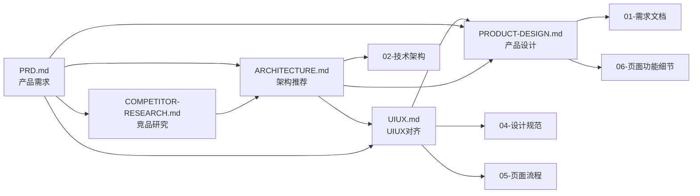
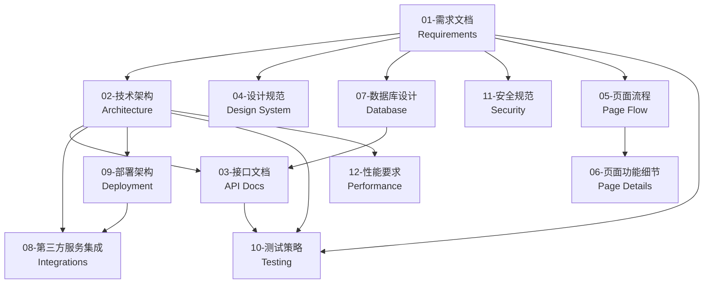

# 模板依赖图和使用指南 | Template Dependency Graph & Usage Guide

> 本文档定义上游文档链模板和 12 个 spec 模板之间的依赖关系、适用项目类型和生成顺序。

---

## 零、上游文档链 | Upstream Document Chain

> 在进入下游 SPEC 模板之前，先完成上游文档链，确保需求经过充分调研和设计论证。

### 上游模板清单 | Upstream Templates

| 模板 | 产出文件 | 作用 | 适用类型 |
|---|---|---|---|
| PRD.md | `.spec/PRD.md` | 产品需求文档（大纲优先迭代） | all |
| COMPETITOR-RESEARCH.md | `.spec/COMPETITOR-RESEARCH.md` | 竞品研究（GitHub/市场竞品分析） | all |
| ARCHITECTURE.md | `.spec/ARCHITECTURE.md` | 架构推荐（候选方案对比 + 推荐） | all |
| UIUX.md | `.spec/UIUX.md` | UIUX 对齐（设计系统 + 页面清单） | web |
| PRODUCT-DESIGN.md | `.spec/PRODUCT-DESIGN.md` | 产品设计（页面功能详情 + 验收标准） | web |

### 上游依赖关系图 | Upstream Dependency Graph



### 上游到下游的契约 | Upstream-to-Downstream Contracts

| 上游文档 | 下游模板 | 继承内容 |
|---|---|---|
| PRD.md | 01-需求文档 | 用户故事、验收标准、非功能要求 |
| SPEC.md | TODO.md | 可实现条款、页面功能缺口、架构约束的 TODO 映射 |
| TODO.md | TASKS.md | 原子任务拆分、任务依赖、Wave 分组 |
| ARCHITECTURE.md | 02-技术架构 | 技术栈选型、目录结构、模块划分 |
| ARCHITECTURE.md | 07-数据库设计 | 数据模型概要 |
| UIUX.md | 04-设计规范 | 设计系统（色彩、排版、间距） |
| UIUX.md | 05-页面流程 | 页面关系树 |
| PRODUCT-DESIGN.md | 06-页面功能细节 | 页面功能详情、交互状态 |

---

## 一、下游 SPEC 模板依赖关系图 | Downstream SPEC Template Dependency Graph



---

## 二、模板元数据 | Template Metadata

### 01-需求文档（Requirements Document）
<!-- depends-on: none -->
<!-- required-for: web, api, cli -->
- **依赖**: 无（根模板）
- **被依赖**: 02, 04, 05, 07, 10, 11
- **适用类型**: all
- **必选/可选**: **必选** required
- **生成顺序**: 1（最先生成）

### 02-技术架构（Technical Architecture）
<!-- depends-on: 01-需求文档 -->
<!-- required-for: web, api, cli -->
- **依赖**: 01-需求文档
- **被依赖**: 03, 08, 09, 10, 12
- **适用类型**: all
- **必选/可选**: **必选** required
- **生成顺序**: 2

### 03-接口文档（API Documentation）
<!-- depends-on: 02-技术架构, 07-数据库设计 -->
<!-- required-for: web, api -->
- **依赖**: 02-技术架构, 07-数据库设计
- **被依赖**: 10-测试策略
- **适用类型**: web, api
- **必选/可选**: **必选** required（web/api），skip（cli）
- **生成顺序**: 4（等 07 完成后）

### 04-设计规范（Design System）
<!-- depends-on: 01-需求文档 -->
<!-- required-for: web -->
- **依赖**: 01-需求文档
- **被依赖**: 06-页面功能细节
- **适用类型**: web
- **必选/可选**: **必选** required（web），skip（api/cli）
- **生成顺序**: 3

### 05-页面流程（Page Flow）
<!-- depends-on: 01-需求文档 -->
<!-- required-for: web -->
- **依赖**: 01-需求文档
- **被依赖**: 06-页面功能细节
- **适用类型**: web
- **必选/可选**: **必选** required（web），skip（api/cli）
- **生成顺序**: 3

### 06-页面功能细节（Page Feature Details）
<!-- depends-on: 05-页面流程, 04-设计规范 -->
<!-- required-for: web -->
- **依赖**: 05-页面流程, 04-设计规范
- **被依赖**: 无
- **适用类型**: web
- **必选/可选**: **必选** required（web），skip（api/cli）
- **生成顺序**: 5

### 07-数据库设计（Database Design）
<!-- depends-on: 01-需求文档 -->
<!-- required-for: web, api -->
- **依赖**: 01-需求文档
- **被依赖**: 03-接口文档
- **适用类型**: web, api（cli 可选）
- **必选/可选**: **必选** required（web/api），optional（cli）
- **生成顺序**: 3

### 08-第三方服务集成（Third-Party Integrations）
<!-- depends-on: 02-技术架构, 09-部署架构 -->
<!-- required-for: web -->
- **依赖**: 02-技术架构, 09-部署架构
- **被依赖**: 无
- **适用类型**: web（api 可选）
- **必选/可选**: optional
- **生成顺序**: 6

### 09-部署架构（Deployment Architecture）
<!-- depends-on: 02-技术架构 -->
<!-- required-for: web, api -->
- **依赖**: 02-技术架构
- **被依赖**: 08-第三方服务集成
- **适用类型**: web, api
- **必选/可选**: optional（web），**必选** required（api），skip（cli）
- **生成顺序**: 5

### 10-测试策略（Testing Strategy）
<!-- depends-on: 02-技术架构, 03-接口文档, 01-需求文档 -->
<!-- required-for: web, api, cli -->
- **依赖**: 02-技术架构, 03-接口文档, 01-需求文档
- **被依赖**: 无
- **适用类型**: all
- **必选/可选**: **必选** required
- **生成顺序**: 5

### 11-安全规范（Security Standards）
<!-- depends-on: 01-需求文档 -->
<!-- required-for: web, api -->
- **依赖**: 01-需求文档
- **被依赖**: 无
- **适用类型**: web, api（cli 可选）
- **必选/可选**: **必选** required（web/api），optional（cli）
- **生成顺序**: 4

### 12-性能要求（Performance Requirements）
<!-- depends-on: 02-技术架构 -->
<!-- required-for: web, api -->
- **依赖**: 02-技术架构
- **被依赖**: 无
- **适用类型**: web, api
- **必选/可选**: optional
- **生成顺序**: 5

---

## 三、项目类型模板子集 | Project Type Template Subsets

### Web 全栈（Full-Stack Web）
全部 12 个模板：01 → 02 → {04, 05, 07} → {03, 06} → {09, 10, 11} → {08, 12}

| 必选 Required | 可选 Optional |
|---|---|
| 01, 02, 03, 04, 05, 06, 07, 10, 11 | 08, 09, 12 |

### API 服务（API Service）
8 个模板：01 → 02 → 07 → 03 → {09, 10, 11} → 12

| 必选 Required | 可选 Optional | 跳过 Skip |
|---|---|---|
| 01, 02, 03, 07, 09, 10, 11 | 12 | 04, 05, 06, 08 |

### CLI 工具（CLI Tool）
5 个模板：01 → 02 → 10 → {11, 12}

| 必选 Required | 可选 Optional | 跳过 Skip |
|---|---|---|
| 01, 02, 10 | 07, 11 | 03, 04, 05, 06, 08, 09, 12 |

---

## 四、生成顺序规则 | Generation Order Rules

### 上游文档链生成顺序 | Upstream Generation Order

1. **PRD.md** — 大纲优先迭代，用户确认大纲后再细化
2. **COMPETITOR-RESEARCH.md** — 使用 grep_app_searchGitHub 搜索竞品
3. **ARCHITECTURE.md** — 生成 2-3 个候选方案，对比后推荐
4. **UIUX.md** — 仅 Web 项目，定义设计系统和页面清单
5. **PRODUCT-DESIGN.md** — 仅 Web 项目，细化页面功能

### 下游 SPEC 模板生成顺序 | Downstream SPEC Generation Order

1. **始终先生成** 01-需求文档（所有类型的根依赖）
2. **紧接着生成** 02-技术架构（大部分模板的上游依赖）
3. **并行生成** 同一层级的无依赖模板（如 04/05/07 可并行）
4. **最后生成** 叶子节点模板（06, 08, 10, 12）
5. **跳过** 项目类型标记为 skip 的模板

### 完整生成流程 | Complete Generation Flow

```
上游文档链:
  PRD.md (大纲确认) → COMPETITOR-RESEARCH.md → ARCHITECTURE.md → UIUX.md → PRODUCT-DESIGN.md

下游 SPEC 模板:
  SPEC.md → TODO.md → TASKS.md → SpecOrchestrator
  01 → 02 → {04, 05, 07} → {03, 06} → {09, 10, 11} → {08, 12}
```

### 交叉引用标记格式 | Cross-Reference Tag Format

每个模板文件头部必须包含以下元数据标记：

```markdown
<!-- depends-on: 01-需求文档, 02-技术架构 -->
<!-- required-for: web, api -->
<!-- generation-order: 4 -->
```

Agent 在生成模板时，必须先检查 `depends-on` 列出的模板是否已生成。如果未生成，先生成依赖模板。
